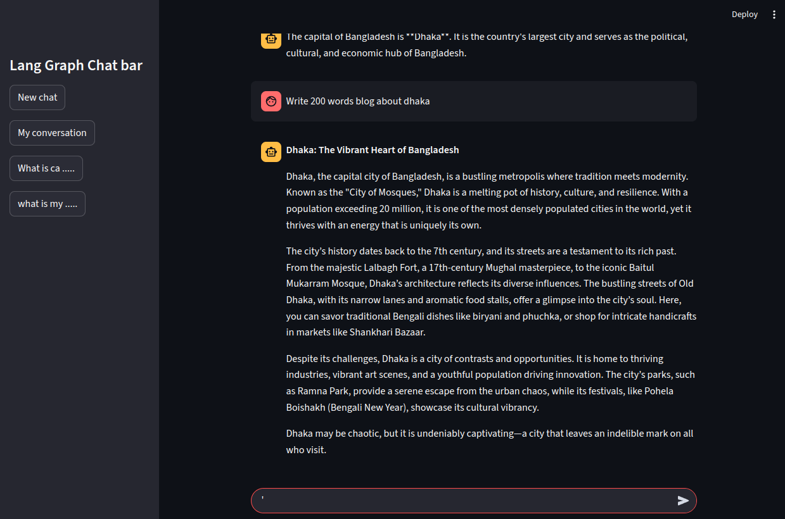

# LangGraph-Powered Multi-Threaded Chatbot

This project is an advanced chatbot application that combines the power of **Cohere's Command R+ model**, **LangGraph**, and **Streamlit** to enable dynamic, multi-threaded conversations with persistent chat history. It runs locally and supports multiple concurrent chat threads, simulating a ChatGPT-like experience with the added benefit of restoring previous sessions.

---


### 🧠 Key Features

- ⚡ **Powered by Cohere Command R+**
- 🔄 **Multi-threaded Chat Support** using LangGraph with unique thread IDs
- 💬 **Persistent Chat History** using SQLite (via `SqliteSaver`)
- 🖼️ **Streamlit UI** for a clean and interactive user experience
- 🔧 **Lightweight Local Backend**
- 🛠️ **Easy to Extend** for future features like thread deletion or user authentication

---

### 🛠 Tech Stack

| Layer             | Technology               |
|------------------|--------------------------|
| LLM               | Cohere Command R+        |
| Graph-based Logic | LangGraph                |
| UI Framework      | Streamlit                |
| State Management  | Thread ID (LangGraph)    |
| Database          | SQLite (SqliteSaver)     |
| Deployment        | Localhost (dev-friendly) |

---

## 📦 Installation

> Make sure you have Python 3.10+ installed.

```bash
# Clone the repo
git clone https://github.com/nadimbrur/LangGraph-Powered-Multi-Threaded-Chatbot-with-Cohere-API.git
cd LangGraph-Powered-Multi-Threaded-Chatbot-with-Cohere-API


# Install dependencies
pip install -r requirements.txt

# Set environment variable for Cohere API
export COHERE_API_KEY="your-api-key-here"  # or use a .env file

# Run the app
streamlit run streamlit_frontend_database.py
```
🧑‍💻 Usage

Launch the app using streamlit run app.py
Type in a message to begin chatting
Each session uses a unique thread ID — allowing multiple parallel conversations
Restarting the app will restore all prior chat history from SQLite


📁 Project Structure
```bash
├── streamlit_frontend_database.py #Streamlit frontend
├── langgraph_database_backend.py        # Backend
├── chatbot.db          # Chat logic, DB saver (SqliteSaver)
├── requirements.txt
└── README.md
```

## 📸 Screenshots / Demo

Below is screenshot of the chatbot interface:

### Chat Interface




🛣️ Future Improvements

 Thread deletion & management

 User authentication

 Public API layer

 Deployment on Streamlit Cloud or Docker
